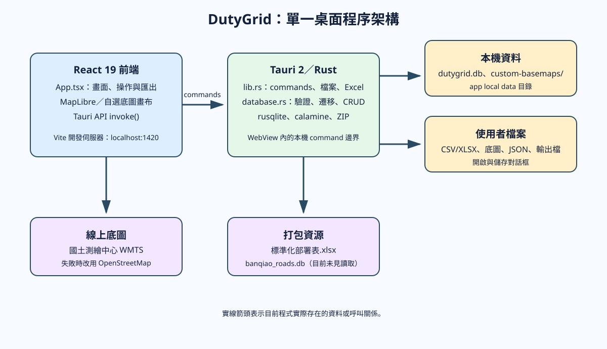
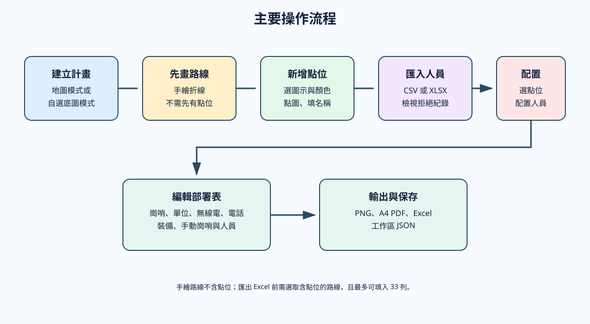
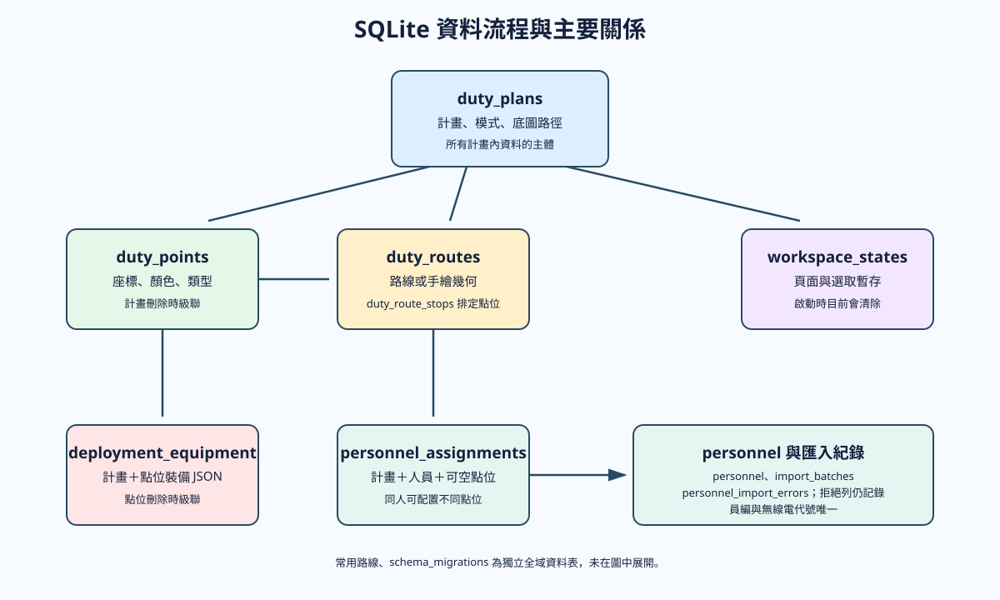

# 系統架構與維護說明

## 架構摘要

DutyGrid 是單一桌面程序：React 19 前端在 Tauri WebView 中執行，透過 `@tauri-apps/api` 的 `invoke()` 呼叫 Rust 指令。Rust 使用 `rusqlite` 與 SQLCipher 開啟本機加密的 `dutygrid.db`，資料庫金鑰由作業系統憑證儲存區管理；首次使用時執行遷移與人員種子資料建立。沒有 HTTP API、後端常駐服務或遠端資料庫。詳見 [資料保護與稽核](security.md)。

地圖模式由 MapLibre GL 顯示國土測繪中心 WMTS；MapLibre 的 `error` 事件會將 style 改為 OpenStreetMap fallback。自選底圖模式完全由選取圖片與前端 Canvas/SVG 繪製。匯出 Excel 時 Rust 直接修改打包的標準部署表 ZIP/XML；PNG/PDF 地圖由前端 Canvas 產生。

## 模組職責

| 路徑 | 實際職責 |
| --- | --- |
| `src/main.tsx` | 掛載 React StrictMode 與全域樣式。 |
| `src/app/App.tsx` | 全部畫面狀態、導覽、Tauri 呼叫、表單驗證、工作區 JSON、部署表、PNG/PDF/Excel 匯出協調。 |
| `src/features/map/MapCanvas.tsx` | MapLibre 地圖、線上底圖 fallback、地圖點位/路線、座標回呼與畫布輸出。 |
| `src/features/map/CustomBasemapCanvas.tsx` | 自選底圖的縮放、拖曳、XY 點位、折線與 PNG 輸出。 |
| `src/features/map/CustomBasemapOutput.tsx` | 將自選底圖輸出覆蓋到地圖輸出區。 |
| `src/styles.css` | 全部畫面與地圖覆蓋層樣式。 |
| `src-tauri/src/lib.rs` | Tauri command 邊界、檔案 I/O、底圖複製、Excel 範本填寫與程式啟動。 |
| `src-tauri/src/database.rs` | SQLite schema migration、資料模型、CRUD、人員 CSV/XLSX 匯入與 Rust 測試。 |
| `src-tauri/migrations/` | 0001–0017 的增量 schema 變更。 |
| `data/seeds/personnel-sample.csv` | 初次建立資料庫時匯入的 56 筆種子人員。 |
| `標準化部署表.xlsx` | Excel 匯出的格式範本。 |

## 資料模型

| 資料表 | 用途與關聯 |
| --- | --- |
| `schema_migrations` | 已套用的 migration 版本。 |
| `duty_plans` | 勤務計畫，含模式、可選底圖路徑/尺寸；其他表的主體。 |
| `duty_points` | 計畫的點位、顏色、類型、經緯度與可選 XY 座標；刪除計畫時級聯刪除。 |
| `duty_routes` | 點位序列或手繪幾何路線，含顏色與線型。 |
| `duty_route_stops` | 路線與點位的順序關聯；點位刪除受到 `RESTRICT`。 |
| `common_routes` | 跨計畫可重用的路線幾何。 |
| `personnel` | 員編、無線電代號、姓名、職稱、單位、電話；員編與無線電代號各自唯一。 |
| `import_batches`、`personnel_import_errors` | 每批人員匯入統計與拒絕列原因。 |
| `personnel_assignments` | 計畫、人員、可空的點位與指派職稱/單位。最新版允許同一人在不同點位配置。 |
| `deployment_equipment` | 計畫＋點位的裝備 JSON。 |
| `workspace_states` | 選取頁面、路線、點位和部分部署/地圖輸出暫存 JSON。 |

詳細關係請參考 [資料流程圖](images/data-flow.svg)。

## Tauri command 介面

前端僅透過 Tauri command 與 Rust 溝通。主要群組為：

- 計畫與底圖：`list_duty_plans`、`create_duty_plan`、`import_custom_basemap`。
- 點位與路線：`list/create/update/delete/move_duty_point`、`list/create/delete/update_duty_route`、`create_manual_route`、常用路線命令。
- 人員：`list_personnel`、`import_personnel_file`、`import_default_personnel_file`、配置 CRUD 與最新匯入紀錄。
- 部署與工作區：裝備讀寫、工作區暫存讀寫/清除、任意工作區檔讀寫。
- 匯出：`export_deployment_xlsx` 產生 bytes，`save_exported_file` 寫到使用者選定路徑。

`app_health` 與 `import_personnel_xlsx` 也有註冊 command，但前端沒有呼叫前者或直接呼叫後者。

## 錯誤處理與資料一致性

Rust command 回傳 `Result<…, String>`，前端多以 `try/catch` 或 Promise `.catch()` 將訊息寫入操作面板。後端驗證空白名稱、路線最少兩點、線型與顏色集合、點位類型、更新時的經緯度與 XY 範圍，並對資料庫錯誤加上中文上下文。

人員匯入會逐列處理而非整批回滾：不合法列寫入 `personnel_import_errors`，合法列仍會保存。路線建立與種子資料匯入使用 SQLite transaction。前端修改已選路線色彩/樣式時採樂觀更新，失敗後會還原先前值。

注意：工作區匯出 JSON 格式版本固定為 `1`，讀取時只接受版本 `1` 且必須有 `planId` 與 `workspace`；它不會重建資料庫計畫本體。該檔應搭配同一台電腦既有資料庫使用，跨電腦移轉結果為**待確認**。

## 維護建議

1. 修改 schema 時新增下一號 migration，並在 `migrate()` 加入對應套用與記錄流程；不要修改已發布 migration。
2. 新增 command 時，同步更新 `lib.rs` 的 `generate_handler!`、前端型別/呼叫、錯誤處理與本文件。
3. 變更 Excel 欄位前，確認 `export_deployment_xlsx()` 中的儲存格範圍與 style index；目前假設 sheet1 與 A7:I39 存在。
4. 人員欄位或匯入規則變動時，新增 CSV/XLSX 正反案例測試。
5. 修改 MapLibre 或輸出功能後，以實際網路可用與不可用兩種狀態檢查，並確認自選底圖與地圖模式都能輸出。
6. `tauri.conf.json` 的 CSP 為 `null`；若要強化安全性，應先盤點線上圖磚、WebView 和匯出所需來源，再設定明確 CSP（安全策略內容為**待確認**）。
